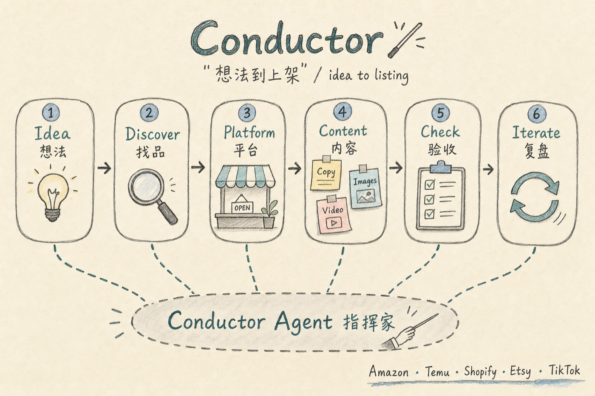

# Conductor

Conductor 是一个面向跨境电商的 AI 工作流系统，帮助卖家把产品想法、商品资料或竞品线索，整理成可以继续执行的选品判断、平台策略、上架文案、商品图片、商品视频和验收结果。



当前核心 Agent 是 **Conductor Agent（指挥家）**。它负责识别用户当前要做什么、收集最低必要信息、调度专业 Agent、检查结果并提供下一步动作。

## 让 AI 承担执行，让运营专注判断

Conductor 的目标不是让运营人员学习更复杂的提示词、填写更多表格，而是把商品资料、平台规则、市场研究和内容生产组织成一条可执行的 AI 工作流。

用户只需提供系统无法可靠获得的信息，并对关键事实和最终方案作出确认；其余工作由指挥家主动完成。

系统会优先：

- 从商品资料库读取已维护的规格、材质、颜色、包装和商品图片。
- 根据商品名称或 SKU 识别产品，并自动处理多 SKU 组合及实际售卖数量。
- 研究目标市场的同类商品、热销信号、可访问评论和未来营销机会。
- 自动生成核心功能、卖点、购买动机、使用场景和定制参考。
- 需要时先生成多个创意方向，用户输入创意编号；输入 `0` 表示系统自动选择。
- 自动应用目标平台的文案、图片、视频和合规要求。
- 先确定创意方向，再提供与该方向一致的可复制完整商品示例；用户回传确认后进入正式生产。

Conductor 不会为了减少输入而牺牲事实准确性。无法可靠确认的商品事实、授权、认证和高风险声明会明确标记，并交由用户作出最终确认。

默认协作路径非常简单：

```text
hello → 选择任务 → 提供最低必要信息 → 确认卖家定制服务（需要时） → 选择创意（需要时） → 回传自动商品示例 → 正式生产 → 下一步动作
```

## 这个系统可以做什么

- 从品类、关键词、人群或短视频场景中筛选商品机会。
- 判断已有产品适合 Temu、Amazon、Shopify、Etsy、TikTok Shop 等哪些平台。
- 研究目标市场的同类商品、热销榜、商品详情页和可访问评论。
- 根据商品和评论痛点生成核心功能、卖点、购买动机和定制示例建议。
- 根据目标市场尚未过去且仍有准备时间的节日生成营销参考。
- 生成平台适配的标题、描述、关键词和广告文案。
- 规划并生成独立的 AI 商品图片。
- 规划商品视频，并在工具支持时生成包含动态画面、情绪口播和烧录字幕的成片。
- 检查文案、图片、视频、平台字段和合规风险。
- 整理输出文件，并提供上架、测试和优化的下一步动作。

## 适合哪些用户

- 只有产品方向，还没有确定具体商品。
- 已有商品或供应商，希望快速准备上架内容。
- 已有竞品链接，希望分析卖点、评论痛点和差异化机会。
- 需要为不同平台生成文案、图片或视频。
- 已有 listing，希望做上架前检查。
- 商品已经上架，希望根据数据和差评继续优化。

## 如何运行

### Agent 工作流

在 **Codex** 中打开本仓库，然后与指挥家对话。产出默认保存到 `output/`。

### Conductor 物料浏览器桌面端

双击仓库根目录的 `Conductor.exe`，即可浏览和验收该程序同目录 `output/` 中的文案、图片、视频与报告等物料。它不是 Agent 本身，也不负责生成内容。

桌面端的使用与开发说明见 [物料浏览器桌面端开发说明](./docs/desktop-development.md)。

## 使用流程

```text
1. 输入“hello”或“你好”
2. 输入数字选择任务
3. 按 Agent 示例输入商品名称、单个 SKU 或 SKU 组合
4. 任务需要视觉依据且资料库没有主图时，上传商品图片或提供可靠外观依据
5. 商品支持定制且本 Listing 服务未明确时，先选择卖家定制服务
6. 如果显示创意方向，输入创意编号；自动选择输入 `0`
7. 查看与已选创意一致的完整商品示例
8. 商品资料不满意可回复“重新生成示例”；创意不合适可回复“重新选择创意”或“重新生成创意”；满意后复制商品资料本体，修改并发回
9. Agent 检查修改是否影响创意；无影响时开始正式生产，有实质影响时重新选择创意并更新示例
```

## 第一步：输入“hello”或“你好”

```text
hello
```

指挥家会显示数字菜单：

```text
你好，欢迎使用  Conductor。请选择你现在的场景：

1. 我已经有产品了，只想生成标题、描述、关键词
2. 我已经有产品了，想生成文案 + AI 商品图
3. 我已经有产品了，想生成文案 + AI 商品图 + 视频脚本
4. 我只有方向或想法，还没有确定具体产品
5. 我有一个产品想法，想判断是否值得做
6. 我有产品，但不确定适合哪个平台
7. 我有竞品链接，想做竞品分析
8. 我只想生成一套商品图
9. 我只想生成视频脚本或短视频
10. 我已经有 listing 草稿，想做上架前 QA
11. 我已经上架了，想做数据复盘和优化
12. 我想保存产物或查看输出目录
13. 我想从选品到上架走完整流程

请输入数字，例如：2
也可以组合输入，例如：2,7
```

完整菜单行为见 [启动向导](./workflows/start-guide.md)。

## 第二步：按任务提供最低必要信息

指挥家会根据所选任务决定需要什么，不会对所有菜单统一索取商品名称和图片。

| 任务 | 商品标识 | 视觉依据 |
| --- | --- | --- |
| 找品、趋势筛选 | 不需要 | 不需要 |
| 文案、关键词 | 商品名称、单个 SKU 或 SKU 组合 | 建议提供 |
| 商品图片、商品视频、完整上架资产 | 商品名称、单个 SKU 或 SKU 组合 | 图库主图、用户商品图、可靠商品链接或充分外观资料至少一种 |
| 竞品分析 | 自有商品可选 | 可用竞品链接、榜单入口、关键词或截图代替 |
| 合规检查、上架 QA | 不一定 | 按检查对象决定 |

需要具体商品时，Agent 会提供带示例值的可复制模板，而不是只列空字段：

请复制代码块里的内容并修改后回传；如果资料库没有该商品主图，视觉任务还需要上传商品图片或提供可靠外观资料：

```text
商品或SKU：MUG0110RD
目标平台：Temu
目标市场：美国
```

需要组合销售时，可以一次输入多个 SKU：

```text
商品或SKU：MUG0110RD * 2, MUG0110WH * 1
目标平台：Temu
目标市场：美国
```

- SKU 匹配忽略英文字母大小写和首尾空格。
- 多个 SKU 自动组成一个组合 listing。
- 未填写数量时默认数量为 1。
- 相同 SKU 会合并并累加数量。
- 匹配成功后使用商品资料库中的标准 SKU。
- 商品资料库没有精确匹配时，系统继续按商品名称、相似商品或新商品处理。

用户已经提供过的信息会被复用，不会重复询问。

## 第三步：选择创意并回传自动商品示例

收到最低必要信息后，指挥家会先完成商品识别、卖家定制服务门禁和市场研究。内容生产任务先确定创意方向，再生成一份与该方向一致、已经填写好的商品示例。

如果经常处理相同商品，可以在 [商品资料库](./data/README.md) 中维护 `product-catalog.csv` 和 `product-attributes.csv`，并配合按 `SPU/SKU` 分类的白底图库。CSV 可以直接通过 Git 查看逐行变化；Agent 每次读取时自动检查表头、SKU、数字、日期、属性关联，以及按 SPU/SKU 推导的图库目录和主图冲突。商品主表不填写图片路径。输入单个 SKU 时，系统自动读取对应资料和图片；输入多个 SKU 时，系统合并各 SKU 的资料、数量和图库，生成一个组合 listing 示例。

示例通常包含：

- 商品名称、类目、类型、目标平台和目标市场。
- 目标平台热销参考链接 2-3 个和选择理由。
- 核心功能。
- 希望突出卖点。
- 主要购买动机。
- 定制示例；普货写“不适用”。
- 平台和品类需要的规格、尺寸、材质、颜色、数量、SKU、包装或定制属性。
- 销售单位、组合形态、实际包含内容和总数量，并同步影响标题、主图、包装清单和价格判断。
- 商品定制能力与本 Listing 的卖家定制服务分开判断；只有卖家定制服务为必选或可选时才生成定制母版和定制操作图。
- 无法可靠确认的事实，统一写“待确认”。

如果不满意，可以回复：

```text
重新生成示例
```

如果创意方向不合适，可以回复：

```text
重新选择创意
```

系统会重新展示上一轮候选菜单。也可以回复：

```text
重新生成创意
```

系统会废弃上一批候选，重新研究并生成一批新方向。完成新的数字选择后，系统会重新生成完整商品资料示例。

如果基本满意，请复制代码块里的商品资料本体，修改不准确或“待确认”的内容后回传给指挥家。当前任务包含文案、图片或视频时，创意方向已在生成本示例前确定；存在多个可执行方向时提供 3-5 个方向供用户选择，输入 `0` 可由系统自动选择，只有一个合理方向时直接形成方案。供应链、利润、合规、QA、保存或查看产物等任务不显示创意菜单。

完整输入和示例规则见 [产品输入模板](./templates/product-input.md)。

## 第四步：生成与验收

用户回传商品示例后，指挥家先检查修改是否影响已选创意，再按照原菜单任务继续执行：

```text
已选创意对应的商品资料
→ 用户修改并回传
→ 创意影响检查
→ 必要时重新选择创意并更新商品示例
→ 文案、图片或视频生产
→ 合规与质量验收
→ 保存产物
→ 提供下一步动作
```

创意方向选择不是让用户写更多内容，而是让用户从 3-5 个已经整理好的具体方向里选一个。用户只需要输入创意编号，例如 `1`；不想判断时输入 `0`，由系统自动选择。如果商品是强规格标准品、用户已经给了明确方向，或用户要求直接输出，系统会跳过选择菜单，但仍会形成并记录可执行创意策略。

创意菜单底部会显示：

```text
请输入创意编号，例如：1；如需系统自动选择，请输入：0。
```

`0` 只在最近一次显示的是创意方向菜单时表示自动选择，不改变启动菜单和下一步动作菜单的编号含义。最终采用的创意主题、核心钩子、证据锚点以及文案、图片、视频主线会记录在完整生产报告第 6 节。

正式交付分为两层：

- **聊天结果**：默认只显示本轮相关内容，例如只做文案就显示文案、风险、保存路径和下一步动作，不再展示无关的图片或视频章节。
- **完整生产报告**：始终按 16 章结构生成，文件名固定为 `上架/完整生产报告.md`。
- **整批版本保护**：首次生产使用基础 Listing 目录；再次生产时整批进入 `{Listing标识}-v2/`、`-v3/`。目录内的文案、图片、视频、脚本、验收报告和完整生产报告保持固定文件名，旧版本不会被静默覆盖。

选择“从选品到上架走完整流程”、生成完整上架包、执行上架前 QA/完整验收，或明确要求“完整报告”“完整 16 章”“按完整模板输出”时，聊天也会直接展开完整报告。详见 [聊天结果模板](./templates/chat-output.md) 和 [完整生产报告模板](./templates/production-output.md)。

## 输出目录

所有产物默认保存到：

```text
output/{平台}-{市场}/{Listing标识}[-vN]/
```

例如：

```text
output/Temu-US/MUG0110RD/
output/Temu-US/MUG0110RD-v2/
output/Temu-US/组合-MUG0110WHx6/
output/Temu-US/组合-BOX000001x1+MUG0110RDx2/
```

单 SKU 且数量为 1 时使用商品资料库中的标准 SKU；数量大于 1 或包含多个 SKU 时自动生成带数量的组合标识；尚未建档的商品使用 `未建档-{简短商品名}`。首次生产不加版本后缀，后续生产只在 Listing 目录末尾添加 `-v2`、`-v3`。商品名称和类目记录在 `商品资料.md` 中，不再增加目录层级。

常见目录包括：

```text
商品资料.md
文案/
图片/
视频/
竞品/
供应链/
合规/
利润/
上架/
  完整生产报告.md
测试/
```

这些是候选目录，不会一次性全部创建。系统只在本轮实际生成对应文件时创建文案、图片、视频、竞品、供应链、合规、利润、上架或测试目录；未执行区域不保留空目录。

完整目录和文件命名规则见 [输出目录规范](./workflows/output-structure.md)。

## 支持的平台

当前内置平台画像包括：

- Amazon
- Temu
- Shopify
- Etsy
- TikTok Shop
- eBay
- AliExpress
- Walmart Marketplace

不同平台会采用不同的搜索、文案、图片、视频和合规策略。详细差异见 [平台画像与适配规则](./platforms/platform-profiles.md)。

同一商品面向不同平台或市场时，必须分别生成内容并保存到不同目录，不能共用一套标题、平台属性或图片技术规格。

## 产物完成标准

- 聊天默认只显示本轮相关结果，但必须包含完成状态、缺失与风险、保存路径和下一步动作。
- 所有菜单的下一步动作都只围绕用户本轮选择的任务：补齐、修改、重生成或查看对应产物。系统不会因为完整报告里存在未执行章节，就推荐其他菜单范围的动作；只有一个合理动作时只显示一个。
- 完整生产报告必须保留 16 个章节；未执行的章节写“本轮未执行”，不能删除。
- 标题不是只凭商品名称生成。系统会优先参考目标平台搜索数据，再结合目标市场 Google Search、Google Trends、Instagram/TikTok/YouTube 和其他电商平台；最终采用的主要关键词必须记录来源和使用位置。
- Temu 商品描述每段最多 `500` 个字符，空格和标点符号也计入；系统会分段生成、逐段计数，超限时按完整句子重新拆段后再交付。
- “生成套图”默认表示实际生成多张独立 AI 商品图，不用拼图或预览图代替。Temu 定制类商品默认以 8 张独立图片为完成标准，缺图时必须标记“未完成”。
- 美国市场的长度尺寸默认同时使用 `cm` 和 `inch`；容量按品类同时保留 `oz` 和 `ml`。
- 最终商品视频必须包含真实动态画面、可听的目标市场语言口播和烧录字幕；缺少任一项只能标记为草稿或“未完成”。
- AI 生成画面只负责表达，不能作为商品材质、做工、认证、检测结果、评价或销量的证据。

## 规则与文档索引

README 只介绍系统用途和操作入口。具体规则集中维护在以下文件中。

### 核心 Agent 与工作流

- [核心 Agent](./agents/cross-border-commerce-agent.md)：角色、编排、输入审查和完整生产流程。
- [子 Agent 体系](./agents/subagents.md)：各阶段 Agent 的职责和调度关系。
- [商品出海流程](./workflows/product-to-listing.md)：从选品到上架、测试和复盘。
- [启动向导](./workflows/start-guide.md)：`你好` 菜单、动态输入和自动示例交互。
- [创意方向选择流程](./workflows/creative-direction-selection.md)：内容生产前的数字创意选择规则，输入 `0` 自动选择。
- [下一步动作菜单](./workflows/action-menu.md)：生成、保存、验收和继续执行的动作。
- [输出目录规范](./workflows/output-structure.md)：文件夹、文件名和保存位置。

### 市场与找品

- [目标市场数据源规则](./platforms/market-data-sources.md)：本地语言关键词、趋势、热销榜、评论和节日筛选。
- [趋势与短视频找品 Agent](./agents/trend-and-video-discovery-agent.md)：从方向、关键词和视频场景提取商品机会。

### 文案与最终输出

- [产品输入模板](./templates/product-input.md)：系统内部产品档案和用户自动示例结构。
- [聊天结果模板](./templates/chat-output.md)：日常任务默认使用的简明结果结构。
- [完整生产报告模板](./templates/production-output.md)：归档和完整展示必须遵循的 16 章结构。
- [通用电商语义与创意规则](./platforms/commerce-semantic-creative-rules.md)：跨平台复用的买家意图、创意模型、问题预判和视觉叙事方法。

### 图片

- [视觉生产 Agent](./agents/visual-production-agent.md)：图片和视频资产的规划、生成与验收。
- [平台套图适配规则](./platforms/image-set-rules.md)：各平台图片结构、条件替换和完成标准。
- [平台图片技术规格](./platforms/image-technical-specs.md)：尺寸、比例、格式、文件大小和质量要求。

### 视频

- [平台视频适配规则](./platforms/video-set-rules.md)：各平台视频内容和成片要求。
- [平台视频技术规格](./platforms/video-technical-specs.md)：比例、时长、文件大小、音频和字幕要求。
- [视频预设场景库](./platforms/video-scene-presets.md)：广告故事、镜头风格、商品动作和场景选择。

### 开发与测试

- [Agent 测试与验收](./docs/agent-testing.md)：规则一致性自动检查、人工对话验收和失败排查。修改 Agent、流程、模板、平台规则或商品资料库后，运行 `npm test` 检查已确定的规则是否仍然一致；它不会代替真实对话、外部平台访问以及图片和视频质量验收。
- [物料浏览器桌面端开发说明](./docs/desktop-development.md)：桌面端运行、开发和构建。

## 基本原则

- 给卖家查看的说明、分析、事实、风险和操作内容统一使用中文。
- 直接面向买家或用于平台搜索、广告投放的最终文案使用目标市场语言。
- 不编造材质、尺寸、功能、认证、销量、排名、评论或供应链事实。
- 外部数据无法访问时明确标记“未获取”或“受访问限制”。
- 自动商品资料示例优先包含 2-3 个目标平台热销参考链接；链接只能作为款式、价格带、主图表达和评论痛点参考，不能证明自己的商品具备相同功能。
- 完整流程默认包含供应链验证：优先查询 1688、Alibaba、义乌购等可访问平台的 3-5 家候选供应商，记录公开联系方式、店铺年限、销量/成交、评分、MOQ、价格和交期；未公开或无法访问的信息写“未获取”，不编造。
- 平台需要登录或验证码时，用户只负责登录和处理验证；Agent 负责搜索、筛选候选、打开页面和整理数据。
- 用户未回传完整商品示例前，不进入正式内容生产。
- 详细平台规则以对应规则文件和平台后台当前要求为准。
