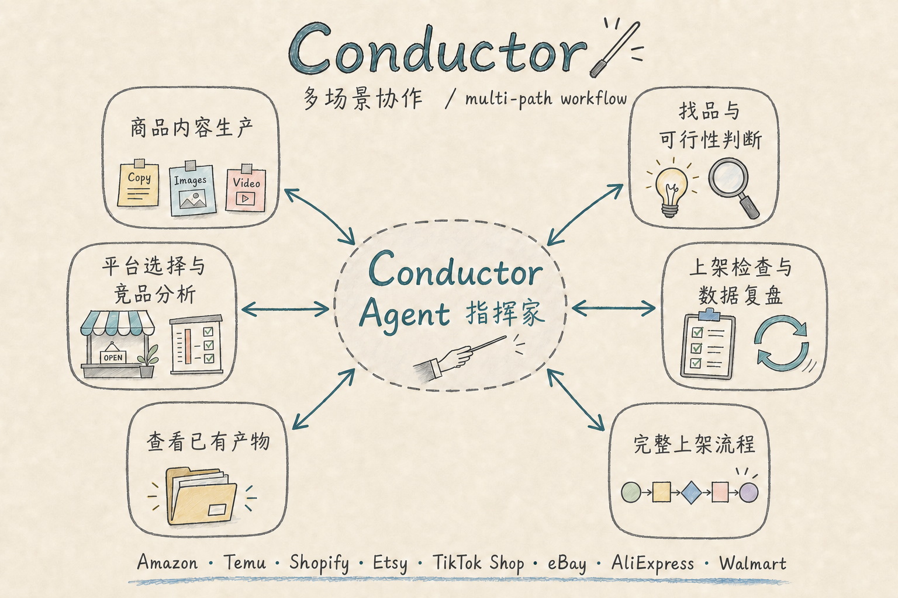

# Conductor

Conductor 是一个面向跨境电商的 AI 工作流系统。它可以从产品想法、已有商品、竞品线索或 Listing 草稿开始，协助完成市场判断、平台策略、内容生产、质量验收和后续优化。

核心 Agent 是 **Conductor Agent（指挥家）**。它负责识别当前任务、收集最低必要信息、调度专业 Agent、检查结果并提供下一步动作。

## 你可以用它做什么

- **商品内容生产**：生成平台适配的标题、描述、关键词、AI 商品图、视频脚本或商品视频。
- **找品与可行性判断**：从品类、关键词、人群或短视频场景中筛选机会，判断产品是否值得推进。
- **平台选择与竞品分析**：比较平台适配度，研究同类商品、评论痛点和差异化机会。
- **上架检查与数据复盘**：检查 Listing、文案、图片、视频和平台字段，分析上架后的表现并提出优化方案。
- **查看已有产物**：按 Listing 标识或目录查看已经生成的商品资料、文案、图片、视频和报告。
- **完整上架流程**：从选品研究开始，继续完成供应链、利润、合规、创意、内容生产和上架验收。

## Conductor 如何工作

用户只需提供系统无法可靠获得的信息，并对关键事实和最终方案作出确认。指挥家会复用商品资料库和当前会话信息，完成所选任务需要的研究、生产和验收。

系统会根据任务决定从哪里开始，不要求所有任务都经过同一条流程：

- 有商品时，先识别商品、销售数量、组合关系和可用素材。
- 需要内容生产时，先确认卖家定制服务，再研究市场并确定创意方向。
- 只有方向或想法时，先做趋势、需求、供应链和风险判断。
- 已有 Listing 或运营数据时，直接进入 QA 或复盘。
- 无法可靠确认的事实会标记为“待确认”“未获取”或“受访问限制”。



## 如何运行

### Agent 工作流

在 **Codex** 中打开本仓库，然后与指挥家对话。产物默认保存到 `output/`。

### Conductor 物料浏览器桌面端

双击仓库根目录的 `Conductor.exe`，即可浏览和验收该程序同目录 `output/` 中的文案、图片、视频与报告。它不负责生成内容。

桌面端的使用与开发说明见 [物料浏览器桌面端开发说明](./docs/desktop-development.md)。

## 如何开始

所有任务共用以下入口：

```text
1. 输入“hello”或“你好”
2. 输入数字选择任务
3. 按提示提供当前任务缺少的最低必要信息
```

输入：

```text
hello
```

指挥家会显示：

```text
你好，欢迎使用  Conductor。请选择你现在的场景：

1. 我已经有产品了，只想生成标题、描述、关键词
2. 我已经有产品了，想生成文案 + AI 商品图
3. 我已经有产品了，想生成文案 + AI 商品图 + 视频脚本
4. 我只有方向或想法，还没有确定具体产品
5. 我有一个产品想法，想判断是否值得做
6. 我有产品，但不确定适合哪个平台
7. 我有竞品链接，想做竞品分析
8. 我只想生成一套商品图
9. 我只想生成视频脚本或短视频
10. 我已经有 listing 草稿，想做上架前 QA
11. 我已经上架了，想做数据复盘和优化
12. 我想保存产物或查看输出目录
13. 我想从选品到上架走完整流程

请输入数字，例如：2
也可以组合输入，例如：2,7
```

完整菜单行为见 [启动向导](./workflows/start-guide.md)。

## 不同任务如何执行

| 菜单 | 任务 | 执行路径 | 主要结果 |
| --- | --- | --- | --- |
| 1 | 生成文案 | 商品识别 → 定制服务确认（需要时） → 市场研究 → 创意选择 → 商品示例确认 → 文案生产 | 标题、描述、关键词 |
| 2 | 生成文案和图片 | 商品识别 → 定制服务确认（需要时） → 市场研究 → 创意选择 → 商品示例确认 → 文案与图片生产 → 图片验收 | 文案、AI 商品图 |
| 3 | 生成文案、图片和视频脚本 | 商品识别 → 定制服务确认（需要时） → 市场研究 → 创意选择 → 商品示例确认 → 文案、图片与视频脚本生产 → 验收 | 文案、AI 商品图、视频脚本 |
| 4 | 从方向寻找商品 | 方向、人群或关键词 → 趋势与内容场景研究 → 候选商品 → 选品初筛 | 候选商品和验证建议 |
| 5 | 判断产品想法 | 产品想法 → 市场需求、竞争、供应链与风险评估 → 选品判断 | 推进或暂缓建议 |
| 6 | 选择销售平台 | 商品识别 → 目标市场确认 → 平台适配比较 | 平台优先级和适配建议 |
| 7 | 分析竞品 | 竞品入口 → 竞品与评论研究 → 卖点、痛点和差异化整理 | 竞品分析 |
| 8 | 生成商品图 | 商品识别 → 定制服务确认（需要时） → 市场研究 → 创意选择 → 商品示例确认 → 套图生成 → 图片验收 | AI 商品图 |
| 9 | 生成视频脚本或视频 | 商品识别 → 定制服务确认（需要时） → 市场研究 → 创意选择 → 商品示例确认 → 视频脚本或视频生产 → 验收 | 视频脚本或商品视频 |
| 10 | 上架前 QA | Listing 草稿或已有产物 → 平台规则、事实、文案与素材检查 | QA 结果和修正清单 |
| 11 | 数据复盘 | 实际商品链接与后台数据 → 线上页面核验 → 表现分析 → 问题定位 → 优化与测试方案 | 数据复盘和优化计划 |
| 12 | 查看产物 | Listing 标识或产物路径 → 定位并读取已有文件 | 已保存产物和目录 |
| 13 | 完整上架流程 | 方向或商品资料 → 选品与市场研究 → 平台、竞品、供应链、利润和合规 → 创意与商品示例确认 → 文案、图片和视频 → 上架 QA | 完整上架包和生产报告 |

组合选择会合并对应路径、复用已有资料并去除重复步骤，不会自动增加未选择的任务。

## 提供最低必要信息

指挥家只收集当前任务真正缺少的信息。

| 任务 | 商品标识 | 视觉依据或检查对象 |
| --- | --- | --- |
| 找品、趋势筛选 | 不需要 | 不需要 |
| 文案、关键词 | 商品名称、单个 SKU 或 SKU 组合 | 商品图片建议提供 |
| 商品图片、商品视频、完整上架资产 | 商品名称、单个 SKU 或 SKU 组合 | 图库主图、用户商品图、可靠商品链接或充分外观资料至少一种 |
| 竞品分析 | 自有商品可选 | 竞品链接、榜单入口、关键词或截图至少一种 |
| 合规检查、上架 QA | 按检查对象决定 | 待检查内容、链接、文件或产物路径 |
| 数据复盘 | 实际商品详情链接；无公开链接时提供卖家后台 Listing 链接，或平台商品 ID + 当前页面截图 | 复盘时间范围和运营数据 |
| 查看产物 | 不需要重新提供商品资料 | Listing 标识或产物路径 |

数据复盘不能只按商品名称执行。实际商品链接用于核对当前线上标题、图片、价格、评价和页面状态；后台数据用于分析曝光、点击、加购、转化、退款和广告表现。缺少有效 Listing 身份时，Conductor 只提示补充资料，不生成复盘结论、报告或输出目录。

需要具体商品时，指挥家会提供带示例值的最小输入模板：

```text
商品或SKU：MUG0110RD
目标平台：Temu
目标市场：美国
```

组合销售可以一次输入多个 SKU：

```text
商品或SKU：MUG0110RD * 2, MUG0110WH * 1
目标平台：Temu
目标市场：美国
```

- SKU 匹配忽略英文字母大小写和首尾空格。
- 未填写数量时默认数量为 1，相同 SKU 会合并并累加数量。
- 多个 SKU 自动组成一个组合 Listing。
- 已在当前会话提供的信息会被复用。
- 商品资料库没有精确匹配时，系统继续按商品名称、相似商品或新商品处理。

经常处理相同商品时，可以在 [商品资料库](./data/README.md) 中维护商品资料和按 `SPU/SKU` 分类的白底图库。

## 内容生产任务示例

以下仅说明已有商品生成文案、图片或视频的交互。其他任务按上方“不同任务如何执行”处理。

### 选择创意并确认商品示例

收到最低必要信息后，指挥家会依次完成：

```text
商品识别
→ 卖家定制服务确认（需要时）
→ 市场研究
→ 创意方向选择（需要时）
→ 生成完整商品资料示例
```

商品示例通常包含：

- 商品名称、类目、类型、目标平台和目标市场。
- 销售单位、组合形态、包含内容和总数量。
- 核心功能、卖点、购买动机和定制示例。
- 目标平台热销参考链接和选择理由。
- 平台及品类需要的规格、尺寸、材质、颜色、包装或定制属性。
- 已选择创意方向、创意主题和核心钩子。
- 仍需用户确认的信息。

商品定制能力与本 Listing 的卖家定制服务分开判断；只有卖家定制服务为必选或可选时才生成定制母版和定制操作图。

商品资料内容不合适但创意方向正确时，回复：

```text
重新生成示例
```

想重新查看上一轮创意候选时，回复：

```text
重新选择创意
```

想废弃上一批候选并重新研究时，回复：

```text
重新生成创意
```

创意菜单输入一个方向编号；输入 `0` 由系统自动选择。`0` 只在最近一次显示的是创意菜单时表示自动选择。

商品示例基本准确时，复制商品资料本体，修改不准确或“待确认”的内容后回传。

### 生成与验收

用户回传商品示例后，指挥家先检查修改是否影响已选创意，再执行所选内容任务：

```text
商品示例确认
→ 创意影响检查
→ 文案、图片或视频生产
→ 合规与质量验收
→ 保存产物
→ 提供下一步动作
```

如果商品身份、销售组合、平台、市场、卖家定制服务、核心功能、目标人群或核心场景发生实质变化，系统会重新选择创意并更新商品示例。

## 输出与版本

聊天结果默认只显示本轮相关内容，包括完成状态、相关结果、缺失与风险、保存路径和下一步动作。

每次正式执行还会保存完整生产报告：

```text
output/{平台}-{市场}/{Listing标识}[-vN]/上架/完整生产报告.md
```

首次生产使用基础 Listing 目录；再次生产使用 `-v2`、`-v3` 目录，旧产物不会被覆盖。

目录示例：

```text
output/Temu-US/MUG0110RD/
output/Temu-US/MUG0110RD-v2/
output/Temu-US/组合-MUG0110WHx6/
output/Temu-US/组合-BOX000001x1+MUG0110RDx2/
```

常见产物目录：

```text
商品资料.md
文案/
图片/
视频/
竞品/
供应链/
合规/
利润/
上架/
  完整生产报告.md
测试/
```

系统只创建本轮实际使用的目录，未执行区域不创建空目录。完整规则见 [输出目录规范](./workflows/output-structure.md)。

## 支持的平台

- Amazon
- Temu
- Shopify
- Etsy
- TikTok Shop
- eBay
- AliExpress
- Walmart Marketplace

不同平台或市场分别生成内容并保存，详细差异见 [平台画像与适配规则](./platforms/platform-profiles.md)。

## 产物完成标准

- 聊天结果包含完成状态、缺失与风险、保存路径和下一步动作。
- 下一步动作只围绕本轮任务，未完成的产物会明确标记。
- 套图由多张独立图片组成，不用拼图或预览图代替。
- 最终视频包含动态画面、可听音频和烧录字幕；缺少任一项会标记为未完成。
- 未确认的商品事实不会写入买家可见内容。

## 文档索引

### 核心 Agent 与工作流

- [核心 Agent](./agents/cross-border-commerce-agent.md)：角色、编排、输入审查和完整生产流程。
- [子 Agent 体系](./agents/subagents.md)：各阶段 Agent 的职责和调度关系。
- [商品出海流程](./workflows/product-to-listing.md)：从选品到上架、测试和复盘。
- [启动向导](./workflows/start-guide.md)：启动菜单、动态输入和自动示例交互。
- [创意方向选择流程](./workflows/creative-direction-selection.md)：内容生产前的创意选择规则。
- [下一步动作菜单](./workflows/action-menu.md)：生成、保存、验收和继续执行的动作。
- [输出目录规范](./workflows/output-structure.md)：文件夹、文件名和保存位置。

### 市场与找品

- [目标市场数据源规则](./platforms/market-data-sources.md)：本地语言关键词、趋势、热销榜、评论和节日筛选。
- [趋势与短视频找品 Agent](./agents/trend-and-video-discovery-agent.md)：从方向、关键词和视频场景提取商品机会。

### 文案与最终输出

- [产品输入模板](./templates/product-input.md)：系统内部产品档案和用户自动示例结构。
- [聊天结果模板](./templates/chat-output.md)：日常任务默认使用的简明结果结构。
- [完整生产报告模板](./templates/production-output.md)：归档和完整展示使用的 16 章结构。
- [通用电商语义与创意规则](./platforms/commerce-semantic-creative-rules.md)：买家意图、创意模型、问题预判和视觉叙事方法。

### 图片与视频

- [视觉生产 Agent](./agents/visual-production-agent.md)：图片和视频资产的规划、生成与验收。
- [平台套图适配规则](./platforms/image-set-rules.md)：各平台图片结构和完成标准。
- [平台图片技术规格](./platforms/image-technical-specs.md)：尺寸、比例、格式、文件大小和质量要求。
- [平台视频适配规则](./platforms/video-set-rules.md)：各平台视频内容和成片要求。
- [平台视频技术规格](./platforms/video-technical-specs.md)：比例、时长、文件大小、音频和字幕要求。
- [视频预设场景库](./platforms/video-scene-presets.md)：广告故事、镜头风格、商品动作和场景选择。

### 开发与测试

- [Agent 测试与验收](./docs/agent-testing.md)：规则一致性检查、人工对话验收和失败排查。
- [物料浏览器桌面端开发说明](./docs/desktop-development.md)：桌面端运行、开发和构建。

## 协作原则

- 卖家侧内容使用中文，买家可见文案使用目标市场语言。
- 用户确认完整商品示例后才进入正式内容生产。
- 未确认的信息不会被写成商品事实。
- 平台规则以对应规则文件和平台后台当前要求为准。
