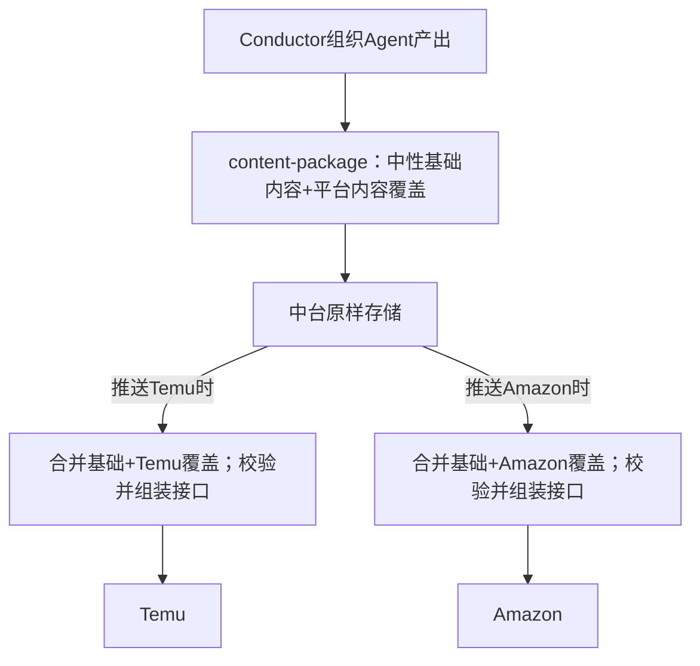

# Conductor × 中台对接总计划

> 状态：讨论中（未定稿）  
> 创建：2026-07-25  
> 范围：Conductor（本仓库）→ 第三方中台 → 跨境平台
> 当前结论：Conductor 提供“中性基础内容 + 平台内容覆盖”的 content-package；中台入库时原样保存，推送平台时再合并、校验并组装接口数据。

本文档记录已对齐共识、拟议分工、Conductor 拟提供数据，以及需要分多轮讨论的议题。结论变更时更新「已对齐」与「未决」两节，避免口头结论丢失。

---

## 1. 术语（已对齐）


| 说法            | 含义                                            |
| ------------- | --------------------------------------------- |
| **Conductor** | 本仓库这套系统：指挥家、规则、商品资料库、`output/` 内容生产与归档        |
| **中台**        | 第三方业务系统（刊登/商品中台等），**不是** Conductor 的一部分       |
| **平台**        | 跨境电商平台：Temu、Amazon、Shopify、Etsy、TikTok Shop 等 |


默认链路：

```text
Conductor 生产数据  →  传递到第三方中台  →  中台提交到对应跨境平台
```

---

## 2. 目标与非目标

### 2.1 目标

- 明确 Conductor 与中台的职责边界，避免平台 API 变更牵动 Agent 规则大改。
- 约定 Conductor → 中台的稳定数据契约（暂称 **content-package / 内容包**）。
- 支持一个商品发送到多个平台：中性基础内容共享，平台差异放在平台内容覆盖片段中。
- 让中台负责：原样保存内容包；推送到具体平台时合并基础内容与平台覆盖，再校验、组合成平台 API 报文、提交和状态回写。
- 与现有 `output/{平台}-{市场}/{Listing标识}/` 归档方式兼容，不推翻现行人工验收流程。


### 2.2 非目标（本阶段不做）

- Conductor 直接调用各平台 OpenAPI 刊登。
- Conductor 输出各平台原生 API JSON 作为主契约。
- 用聊天 Markdown / 完整 16 章报告作为中台唯一解析源。
- 一次讨论定死所有平台字段映射。
- 改变当前聊天简版、完整生产报告、文案、图片、视频和桌面端验收等面向人的产出。

---


## 3. 职责分工（当前倾向）


| 层             | 负责                                                                          | 不负责                                   |
| ------------- | --------------------------------------------------------------------------- | ------------------------------------- |
| **Conductor** | 组织 Agent 生成数据；产出中性基础内容、平台内容覆盖片段、商品事实、媒体、风险和门禁，形成 content-package            | 平台类目 ID、属性码、平台 API 报文、鉴权、限流、真实刊登、订单库存 |
| **中台**        | 入库时原样保存 content-package；推送时合并基础内容与目标平台覆盖，完成校验、字段映射、API 报文组装、媒体上传、提交、重试和结果回写 | 入库时改写内容、创意决策、编造商品事实、替代卖家确认高风险声明       |
| **平台**        | 真实上架与售卖                                                                     | —                                     |


### 3.1 为什么采用「Conductor 出内容包，中台推送时组合」

已讨论过的权衡：

1. 若 Conductor 直接组织「平台接口级」数据，平台接口一变就容易影响 Conductor，维护成本高。
2. 中台最了解平台接口、账号、类目与属性编码，因此应在实际推送时完成校验和组装。
3. 中台入库时只保存，不绑定某个平台的接口形态；同一商品可在后期推送到多个平台。
4. Conductor 仍可通过平台内容覆盖表达 Temu、Amazon 等内容差异，但不生成平台接口字段；**平台内容适配 ≠ 平台接口适配**。

三个层次不要混：


| 层      | 例子                                     | 归属        |
| ------ | -------------------------------------- | --------- |
| 中性基础内容 | 商品事实、语义素材、事实状态和门禁                 | Conductor |
| 上架文案 | `copywriting`：本包目标平台的成品标题/要点/描述/关键词 | Conductor |
| 平台内容覆盖 | 默认仅图集/视频/内容备注；多平台同包时才可带各平台 copywriting | Conductor |
| 平台接口适配 | 字段名、属性码、类目 ID、上传顺序、API JSON            | 中台（推送时）   |





---


## 4. Conductor 拟提供给中台的数据

以下为讨论草案，细节以 [content-package 结构草案](./content-package-schema.md) 与 [轮次默认建议](./轮次默认建议.md) 为准。契约暂称 `content-package`，强调供中台保存，不代表已可刊登。

**默认落盘（待确认）：** `output/{平台}-{市场}/{Listing版本目录}/上架/content-package.json`；媒体仍在同目录 `图片/`、`视频/`。试点可用同级 zip 打包（见草案 §11）。

### 4.1–4.8 摘要

完整字段见结构草案。此处只保留摘要，避免与专题文件漂移：

- **元数据 `metadata`**：含 `content_platform`/`content_market`（正文实际生产平台）与 `recommended_platforms[]`（仅推荐，中台决定是否推其他平台）
- **商品事实**：按 `product-catalog.csv` **当前表头**全量输出（key 与列名完全一致，如 `颜色/款式`）；扩展属性另数组；键已含单位时不写 `unit`
- **中性基础**：语义素材必给
- **上架文案 `copywriting`**：单平台包上品正文（title/bullets/description/keywords），上品必填
- **平台覆盖**：单平台默认仅图集/视频/备注，不含文案；多平台例外才带各平台 copywriting
- **媒体**：`media_id` 引用 + 本地相对路径 / `remote_url` + sha256
- **门禁**：套图/视频完成度、合规风险、人工确认项、事实分级摘要
- **不提供**：OpenAPI 报文、类目 ID、属性码、店铺 token、聊天临时说明

研究类报告（竞品/供应链/利润）默认不进刊登主路径，也不进 zip。


## 5. 与现有 Conductor 产出的关系

当前已有：

- 聊天简版：`templates/chat-output.md`
- 完整生产报告：`上架/完整生产报告.md`（16 章，给人归档/复查）
- Listing 目录规范：`workflows/output-structure.md`

对接原则（草案）：

- **人对人**：继续用聊天简版 + 完整报告 + 桌面端浏览验收。
- **机对机**：新增 content-package（或等价结构化产物）给中台。
- content-package 是现有产物之外的新增契约，不替换聊天简版、完整报告、文案、图片和视频。
- 完整报告 **不替代** content-package；二者可并存。
- 现有 `output/{平台}-{市场}/` 目录继续服务当前生产与人工验收；平台无关基础内容和多平台覆盖将来如何落盘，作为后续议题，不要求现在改目录规范。

---


## 6. 建议讨论议程（分多轮）

按顺序推进，每轮只收口一小块，结论写回本文或拆专题文件。


| 轮次          | 议题                         | 产出                                                                |
| ----------- | -------------------------- | ----------------------------------------------------------------- |
| R0（Round 0） | 术语、边界、非目标（本文 §1–§3）        | **已完成：架构边界已对齐**                                                   |
| R1          | content-package 最小结构       | **草案已写**：[content-package-schema.md](./content-package-schema.md) |
| R2          | `content_status`、门禁与中台校验边界 | **预写**：结构草案 §10                                                   |
| R3          | 传递方式                       | **默认建议已写**：[轮次默认建议.md](./轮次默认建议.md) §R3                           |
| R4          | 媒体交付                       | **预写**：结构草案 §11                                                   |
| R5          | 状态回写                       | **默认建议已写**：轮次默认建议 §R5                                             |
| R6          | 首个试点                       | **默认建议**：Temu-US + 马克杯样本；见轮次默认建议 §R6                              |
| R7          | 多平台扩展                      | **默认建议已写**：轮次默认建议 §R7                                             |
| R8          | 正式规则与工程落地                  | **清单已写**：轮次默认建议 §R8（确认架构后再执行）                                     |


## 全部默认建议仍待你方确认后才升为「已对齐」。


## 7. 未决问题（均已附默认建议，待确认）

讨论时打勾确认或改写默认；确认后移入 §8。

- [x] 落盘：`上架/content-package.json`，版本跟 Listing 目录（草案 §9.4）
- [x] 中台无现成 schema 时以 Conductor 契约为准；有则中台做映射（轮次 §R3）
- [x] 试点人工/脚本 zip；稳态 Conductor 推 API（轮次 §R3）
- [x] 仅 `content_status=ready`（全部准备妥当）才可发送到中台；`partial`/`blocked` 只留在 Conductor 本地补齐，不传中台（草案 §10）
- [x] 属性名与图型 role：中文对齐 CSV / image-set-rules，附英文对照
- [x] 上架文案字段名为 `copywriting`；单平台包上品文案只放此处，`平台覆盖` 不含 title/bullets/description/keywords；`unit` 键已含单位时不写
- [x] 回写：中台权威；Conductor 可选摘要文件（轮次 §R5）
- [x] 完整报告不对中台必传（轮次「其他默认补齐」）
- [x] 首期试点 Temu-US + 马克杯；ready=文案+套图（视频不强制）（轮次 §R6）
- [x] 目录短期仍按 `平台-市场` 落盘；传给中台的包只标记**推荐平台**，是否推到其他平台由中台决定（不要求 Conductor 为每个推荐平台预生成覆盖文案）
- [x] overrides 字段集：单平台默认仅图集/视频/备注；多平台例外才带 copywriting（见草案 §4）
- [x] product_facts 按主表 CSV 当前表头全列（key 不得缩写）+ 扩展表另数组 `extended_attributes[]`；sales_unit、media_id 命名见下两项待确认（草案 §9）
- [ ] 媒体：P0 zip → P2 对象存储 URL（草案 §11）
- [ ] R8 工程清单：确认架构后再改正式规则与导出脚本（轮次 §R8）
---


## 8. 已对齐摘要（便于快速回顾）

1. Conductor / 中台 / 平台三者含义已区分。
2. 目标链路：Conductor 产数据 → 中台 → 平台。
3. Conductor 组织 Agent 产出中性基础内容和平台内容覆盖，不做平台 API 组装。
4. 中台入库时原样保存；推送到具体平台时才合并基础与覆盖，完成校验、接口组装和提交。
5. 一个商品可以共用基础内容并通过不同平台覆盖发送到多个平台。
6. 机对机契约宜结构化（content-package），不宜只靠 16 章 Markdown。
7. content-package 是新增的机对机契约，不改变现有 Conductor 面向人的数据输出。
8. 本计划放在 `plans/中台/`，议题可持续迭代，不要求一次定完。
9. R1–R8 的 **Conductor 侧默认建议已全部预写**（结构草案 + 轮次默认建议），待逐项确认后升格为已对齐。
10. content-package 固定落盘为 `上架/content-package.json`，生产版本跟随 Listing 版本目录，文件名不再添加 `-vN`。
11. 上架文案字段名为 `copywriting`；单平台包上品正文只放 `copywriting`，平台覆盖默认不含标题/要点/描述/关键词；商品事实 `unit` 在键已含单位时省略。
12. 包头元数据字段名为 `metadata`（不用 `envelope`）。
13. 机对机契约以 Conductor 的 content-package 为准；中台若已有内部 schema，由中台做映射，不要求 Conductor 迁就改字段。
14. 传输：试点用 zip 导入；稳态由 Conductor 推 API；不以中台扫本机磁盘为通用方案。
15. 只有全部准备妥当（`content_status=ready`）才可发送到中台；`partial`/`blocked` 仅留在 Conductor 补齐，不传中台。
16. 首期 ready 门禁：文案 copywriting + 约定套图齐；视频不强制。
17. 刊登结果（成功/失败、item_id、错误）以中台为准；Conductor 仅可选落摘要，不覆盖源文案/图片。
18. 完整生产报告不对中台必传；机对机只认 content-package。
19. 传给中台的包只标记推荐平台；是否推送到其他平台由中台处理。Conductor 不因「推荐多平台」而必须预生成多套平台文案。
20. product_facts 的 key 与 `product-catalog.csv` 表头完全一致并全列输出；品类专属参数来自 `product-attributes.csv`，放入 `extended_attributes[]`。

---


## 9. 变更记录


| 日期         | 变更                                                                     |
| ---------- | ---------------------------------------------------------------------- |
| 2026-07-25 | 初稿：术语、边界、数据草案、分轮议程与未决项                                                 |
| 2026-07-25 | R0 收口：改用 content-package；采用“中性基础 + 平台覆盖”；中台只存储、推送时组装；现有 Conductor 产出不变 |
| 2026-07-25 | R1 起草：新增 content-package 结构草案 v0.1                                     |
| 2026-07-25 | R1/R2 预写默认建议（草案 §9–§10）                                                |
| 2026-07-25 | R4 预写：媒体传递（草案 §11）                                                     |
| 2026-07-25 | 补全 R3–R8 默认建议文档；总计划 §4 改为摘要并链专题；未决项全部挂上默认答案待确认                         |
| 2026-07-27 | 确认：文案字段改用 `copywriting`；单平台上品文案只放 `copywriting`，平台覆盖不重复文案；`unit` 键含单位时省略 |
| 2026-07-27 | 包头字段由 `envelope` 改为 `metadata`（元数据） |
| 2026-07-27 | 确认：以 Conductor content-package 为统一契约；中台有内部 schema 时自行映射 |
| 2026-07-27 | 确认：试点 zip 导入；稳态 Conductor 推 API |
| 2026-07-27 | 确认：仅 ready 可发中台；partial/blocked 不传，本地补齐后再发 |
| 2026-07-27 | 确认首期 ready 门禁：文案 + 套图齐；视频不强制 |
| 2026-07-27 | 确认：刊登结果以中台为准；Conductor 可选摘要回写 |
| 2026-07-27 | 确认：完整生产报告不对中台必传 |
| 2026-07-27 | 确认：包内只标推荐平台；跨平台推送由中台决定，Conductor 不强制预生成多平台文案 |
| 2026-07-27 | 修正：product_facts.key 必须与 product-catalog.csv 当前表头一致（如颜色/款式），废止过时的认证列与「37 列」表述 |
| 2026-07-27 | 确认：主表全列进 product_facts；扩展表进 extended_attributes[] |


